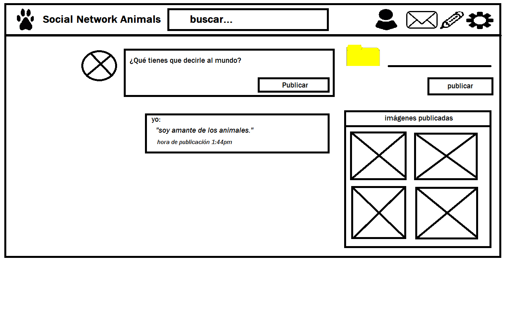
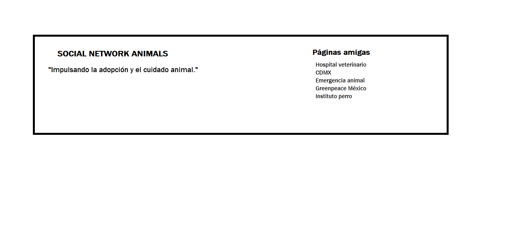

# Producto final - Social Network Animals

## Planeación

***

Hacer una página de adopción a animales y ayudar a los que estén heridos o abandonados.
* Hacer un log in y un sign up con Firebase.
* Capacidad de agregar o seguir personas.
* Un lugar para postear.
* Un lugar para subir imágenes.
* Un newsfeed donde puedes ver las actualizaciones de todos tus contactos.
* Ser mobile friendly.

*** 

## Sketch

***

* Hacer una vista principal para iniciar sesión y registrarse.
  - Ambos serán formularios y tendrán usuario y contraseña.
  - Al iniciar sesión o registrarse como usuario, los llevará a la vista de home.

  

* La segunda vista será home.
  - Tendrá un nav y habrá un buscador, un perfil, una mensajería y un lugar para poder escribir posts.
* Del lado lateral derecho aparecerán los animales para adoptarlos y se desencadenará un modal que tendrá un formulario por si la persona desea adoptarlo.
* En la parte lateral izquierda habrá asociaciones para que puedan seguirlas y ver qué animales hay para adoptar o ayudar.
* En la parte principal estarán los posts de las personas que sigan.

  
  
  

* En la tercera vista será el perfil del usuario, que tendrá lugar a publicar lo que desee y subir fotos.

* En la parte del footer habrá páginas amigas que serán en las que puedan acudir para solicitar ayuda en caso de que la necesiten. 

***

## Funcionalidad

***

* Validar el password, mail y el usuario para el registro y el inicio de sesión.
* agregar modal al ícono de textarea para que el usuario escriba.
* validar subir fotos por firebase.
* hacer las imágenes dinámicas y agregar el botón de "seguir" y "ver".
* El valor que el usuario ingrse en el textarea será el que se pintará en el perfil.
* De igual forma, pintarlo en el newsfeed.